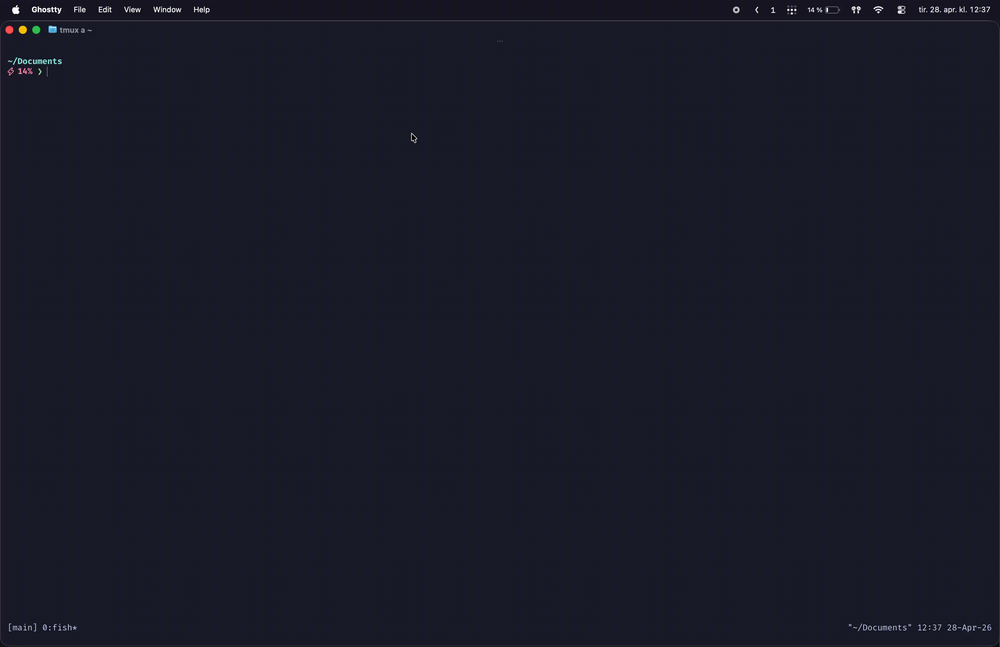
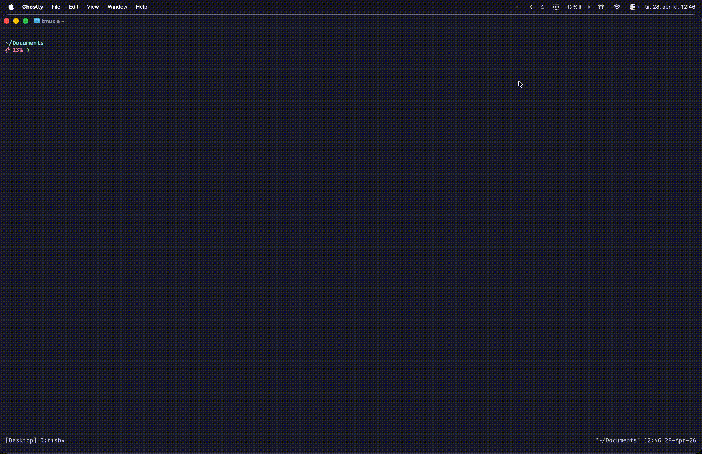

# Notat
- Program som lar deg søke igjennom datamskinen din etter filer
- `lambdaSearch  [input-file]... [options]`

# Flag dokumentasjon
| Flag | Long Form | Purpose |
|------|-----------|---------|
| `-p` | `--pattern` | **SearchPatternFlag** - Defines a search pattern to filter files |
| `-a` | `--show--dots` | **HiddenFilesFlag** - Shows hidden files (those starting with a dot) |
| `-e` | `--extention` | **ExtentionFlag** - Filters or processes files by extension |
| `-i` | `--ignore` | **IgnoreFlag** - Specifies files or paths to exclude from processing |
| `-x` | `--execute` | **ExecuteFlag** - Executes a command on processed files |


### Gjort siden innleveringen 
- Gjort det mulig å søke med `.` eller ingen argumenter. Dette vil da til da bruke working directory
- Gjort det mulig å kjøre commando på filer du søker etter (beta)
- Gjort slik at det er bare filen som blir grønn. Og ikke hele stien (gif er ikke oppdatert)
- Lage TUI for søkingen (Veldig basic, men det er noe)
- Skrive Treverseingsfunkjonen mer generelt
- Tester
- Du kan åpne det du har søkt på i vim (din editor henter fra env var) igjennom TUI-en 

### Mangler.
- Treversere paralelt med STM monaden
- Fuzzy search funksjonalitet. ()


### Kjente feil.
- Excute flagget er litt buggy noen ganger
- Når den parser punktum så kan du ikke ha flere stier

### Clone and install
```bash
git clone https://git.app.uib.no/martin.e.knutsen/inf221-Semesteroppgave.git && cd inf221-Semesteroppgave && cabal install

```
### Om du allerde har innstallert, men vil ha nye edringer
```bash
cabal install --overwrite-policy=always
```

### Eksempelbruk
```bash
lambdaSearch . -e hs
lambdaSearch  -e hs
lambdaSearch TUI # for å kjøre tui

# Bruker POSIX Extended Regular Expressions (ERE)
lambdaSearch -p ^test[0-9]+

# Fungerer med vilkårlig rekkefølge på argumentet. Og med både long og short sammen
lambdaSearch  -p foo -e hs
lambdaSearch --extention hs -p Pars

lambdaSearch /foo/bar -e hs
lambdaSearch "/foo/bar" -e hs
lambdaSearch "/foo/bar" "/bar/foo" -p test -e hs

# Gir jo ut til stdout så du kan bruke med andre cli tools fzf, grep, sk, vim, awk, cut, sed, fmt, tr, cat, ripgrep
lambdaSearch "/foo/bar" "/bar/foo" -p test -e hs
lambdaSearch "/foo/bar" "/bar/foo" -e hs | fzf --tmux 80%  | xargs nvim
lambdaSearch . -e hs | cut -d / -f 10 | sort | uniq -c

# Execute commands on files found substiue {} for filepath, 
# Kanskje litt buggy
lambdaSearch -e hs -x cat {} 
```



