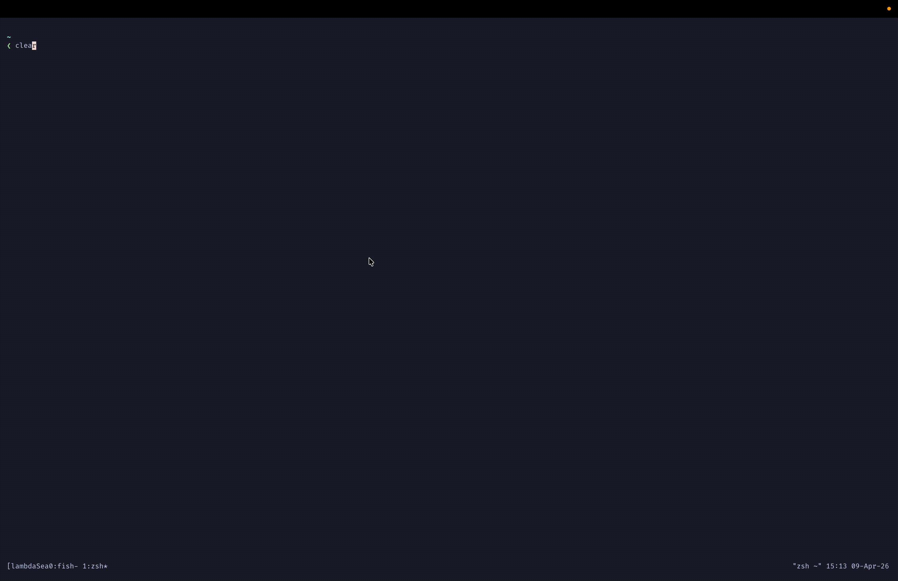
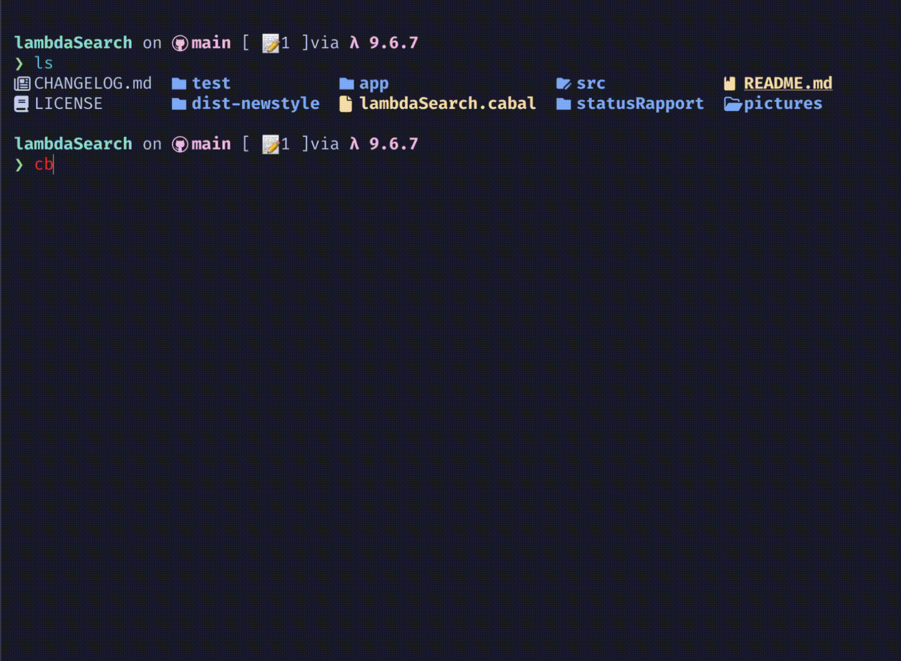

# Notat
- Program som lar deg søke igjennom  datamskinen din
- lms {sti} -p {regxPattern}  (--hide-dots {False/Ture}  --exclude [],)?


### Hvordan man kjører appen
- Har enda ikke implementert parsing så du må inn i `app/Main.hs` å legge inn manuelt in datastukturene

```bash
git clone git@git.app.uib.no:martin.e.knutsen/inf221-Semesteroppgave.git && cd inf221-Semesteroppgave && cabal install
```


##  Eksmepl på noen som kjører
-  Du må forløpig gi hele stien, men støtte for . kommer

```bash
lambdaSearch "/foo/bar" -e java
lambdaSearch "/foo/bar" "/bar/foo" -p test -e java

# Gir jo ut til stdout så du kan bruke med andre cli tools fzf, grep, sk, tmux 
lambdaSearch "/foo/bar" "/bar/foo" -p test -e java
lambdaSearch "/foo/bar" "/bar/foo" -e hs | fzf --tmux 80%  | xargs nvim
```



# Flag dokumentasjon

| Flag | Long Form | Purpose |
|------|-----------|---------|
| `-p` | `--pattern` | **SearchPatternFlag** - Defines a search pattern to filter files |
| `-a` | `--show--dots` | **HiddenFilesFlag** - Shows hidden files (those starting with a dot) |
| `-e` | `--extention` | **ExtentionFlag** - Filters or processes files by extension |
| `-i` | `--ignore` | **IgnoreFlag** - Specifies files or paths to exclude from processing |
| `-x` | `--execute` | **ExecuteFlag** - Executes a command on processed files |


## Eksmepel på hvordan man kjører appen (Fungerer ikke enda)
```bash
lms "/Users/lorem/testMappe/" -p lorem122 -a -e md -i "/foo/bar/foo/bar" "/foo/bar/foo/bar"  -x "pandoc -o {}.pdf {}"
lms /Users/lorem/testMappe/ -p lorem122 -e md -i "/Users/lorem/ikkeTaMeddette" -x "pandoc -o {}.pdf {}"
lms -p cola -e png #søker etter alle filer med cola i seg som er en png. mappen du står i
```





